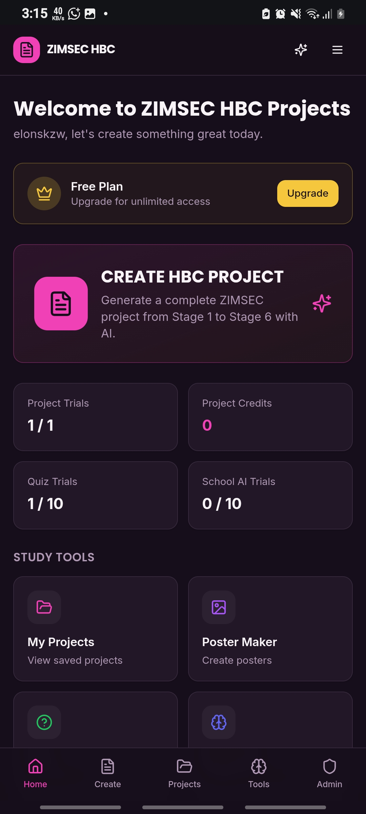
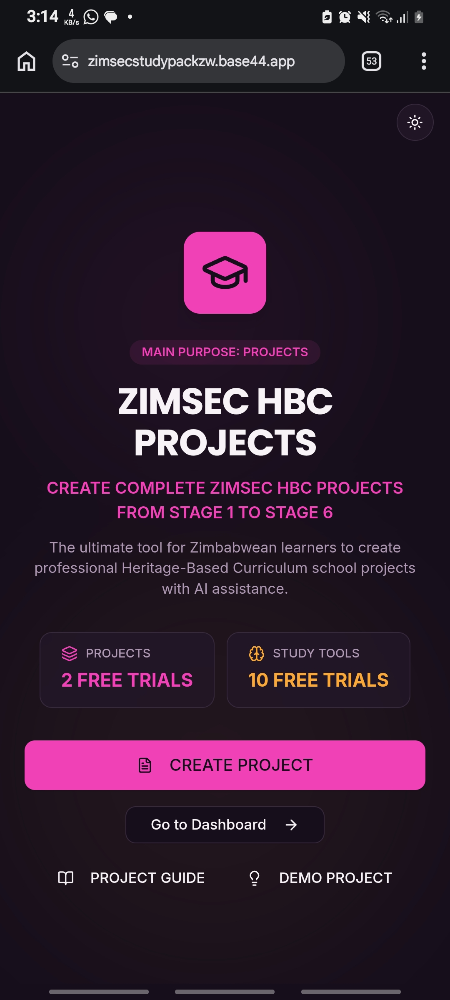
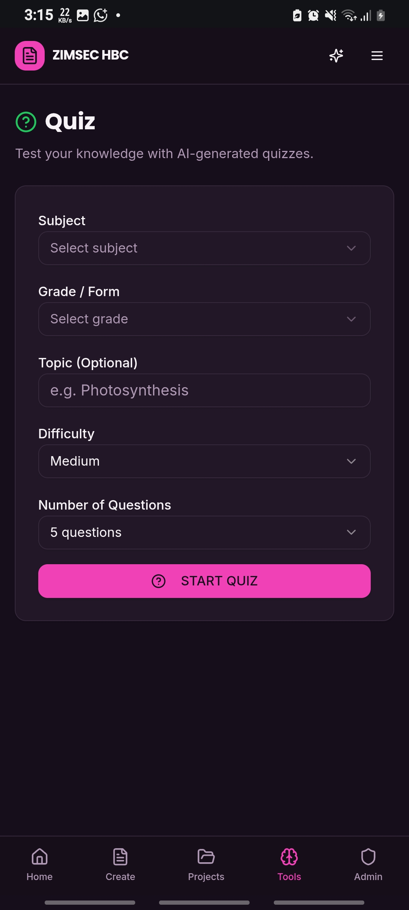

📚 ZIMSEC HBC PROJECTS 🇿🇼

  

<h1 align="center">ZIMSEC HBC PROJECTS</h1>

  <strong>Heritage-Based Curriculum Projects Made Simple</strong>

  A digital platform designed to help Zimbabwean learners explore,
  understand and organise ZIMSEC-style Heritage-Based Curriculum projects.

  <a href="https://zimsecstudypackzw.base44.app">
    🚀 OPEN ZIMSEC HBC PROJECTS
  </a>

---

🌟 Overview

ZIMSEC HBC PROJECTS is a digital educational platform designed for Zimbabwean learners working on Heritage-Based Curriculum (HBC) projects.

The platform provides a simple and modern way to explore project topics, understand the six project stages, organise project information and access useful educational resources.

It is designed with mobile users, students and teachers in mind, making it easy to access educational content from phones, tablets and computers.

🎯 Main Goals

- Make HBC projects easier to understand.
- Help learners organise projects from Stage 1 to Stage 6.
- Provide useful project topics and ideas.
- Support Zimbabwean learners with digital educational resources.
- Make project preparation faster and more organised.
- Provide a simple mobile-friendly learning experience.

---

🚀 Live Web App

🌐 Visit ZIMSEC HBC PROJECTS

<a href="https://zimsecstudypackzw.base44.app">
  <strong>https://zimsecstudypackzw.base44.app</strong>
</a>
«The web application is designed to work on mobile phones, tablets, laptops and desktop computers.»

---

📱 Platform Screenshots

  <strong>Explore the ZIMSEC HBC PROJECTS platform</strong>

<!-- Horizontal scrolling screenshot gallery -->
  

    
  
  

    
  
  

    
  

«📱 On mobile: swipe left or right to view the screenshots.»

---

✨ Key Features

📝 Heritage-Based Curriculum Projects

ZIMSEC HBC PROJECTS is focused on helping learners understand and organise Heritage-Based Curriculum projects.

The project workflow covers six major stages:

Stage 1 — Problem Identification

Identify and clearly explain the problem that the project is addressing.

Stage 2 — Investigation of Related Ideas

Research related ideas, approaches and existing ways of addressing the problem.

Stage 3 — Possible Solutions

Explore possible solutions and identify the selected solution for development.

Stage 4 — Development and Refinement

Develop and improve the selected solution.

Stage 5 — Final Solution

Present the actual completed solution produced by the learner.

Stage 6 — Evaluation & Recommendations

Evaluate the completed project and provide useful recommendations.

---

🤖 AI-Assisted Project Creation

The platform can help organise project information into a complete HBC project structure.

A learner can provide information such as:

SUBJECT
TOPIC
SCHOOL / COMMUNITY
CHOSEN SOLUTION

The project can then be organised into:

STAGE 1
STAGE 2
STAGE 3
STAGE 4
STAGE 5
STAGE 6

Example

Subject: Science
Topic: Water Pollution
Community: Zimunya
Chosen Solution: Awareness Poster

The system can use this information to help structure the project.

---

🎓 Subjects

The platform can support project work across different school subjects, including:

- 📐 Mathematics
- 📖 English
- 🗣️ Shona
- 🔬 Science
- 🧪 Combined Science
- 💻 Computer Science
- 🖥️ ICT
- 🌍 Geography
- 🇿🇼 Heritage Studies
- 🏃 Physical Education
- 🌱 Environmental Science
- 🧱 Building Technology
- 🌾 Agriculture
- 👥 Social Science
- And other school subjects

---

💡 Project Topics & Ideas

Learners can explore project ideas based on school and community challenges.

Examples include:

- Drug and substance abuse
- Bullying
- Cyberbullying
- Environmental pollution
- Littering
- Water pollution
- Soil erosion
- Electricity wastage
- Road safety
- Entrepreneurship
- Identity
- Education challenges
- Health and safety awareness
- Environmental conservation
- Community development

---

🇿🇼 Built for Zimbabwe

ZIMSEC HBC PROJECTS is designed specifically around the needs of learners in the Zimbabwean education environment.

The platform focuses on:

- ZIMSEC-related resources
- Heritage-Based Curriculum projects
- Zimbabwean school subjects
- Project stages
- School and community-based topics
- Mobile-friendly educational access

---

📱 Mobile Friendly

The platform is designed for learners who primarily access educational resources using mobile devices.

Supported Devices

Device| Support
📱 Android Phones| ✅
📱 iPhone| ✅
📲 Tablets| ✅
💻 Laptops| ✅
🖥️ Desktop Computers| ✅

---

⚡ Simple & Easy to Use

The platform focuses on a clean and accessible experience.

Highlights

- Modern interface
- Responsive design
- Easy navigation
- Mobile-friendly layout
- Organised project workflow
- Educational resources
- Fast access to project information
- Simple project creation process

---

📚 Educational Resources

ZIMSEC HBC PROJECTS can serve as a central location for useful Zimbabwean school resources.

Future and existing resources can include:

- 📄 ZIMSEC past papers
- 📚 Revision materials
- 📝 School notes
- 📖 Project guides
- 💡 Project topics
- 🎓 Study resources
- 🧠 Learning tools
- 📑 Educational references

---

🔎 Search Engine Friendly

ZIMSEC HBC PROJECTS is built around educational topics that Zimbabwean learners commonly search for online.

Popular Search Terms

ZIMSEC projects
ZIMSEC HBC projects
Heritage Based Curriculum projects
Heritage-Based Education Zimbabwe
ZIMSEC project stages
HBC project Stage 1 to Stage 6
Zimbabwe school projects
ZIMSEC project topics
ZIMSEC project examples
HBC project ideas
ZIMSEC educational resources
Zimbabwe student resources
Primary school projects Zimbabwe
Secondary school projects Zimbabwe
O Level projects Zimbabwe
Heritage Based Curriculum project guide
How to write a ZIMSEC project
How to write an HBC project
ZIMSEC project solutions
Zimbabwe school resources

---

🛠️ Technology Stack

Technology| Purpose
HTML5| Structure and content
CSS3| Styling and responsive interface
JavaScript| Interactive functionality
Responsive Web Design| Mobile and desktop support
Base44| Web application platform
AI Technology| Project assistance
Digital Resources| Educational content

---

📂 Project Structure

ZIMSEC-HBC-PROJECTS/
│
├── Images/
│   ├── Screenshot_20260915_151534_Chrome.jpg
│   ├── Screenshot_20260915_151453_Chrome.jpg
│   └── Screenshot_20260915_151530_Chrome.jpg
│
├── index.html
├── README.md
└── LICENSE

---

🌐 Web Application

Official Web App:

<a href="https://zimsecstudypackzw.base44.app">
https://zimsecstudypackzw.base44.app
</a>---

🤝 Contributions

Suggestions and improvements are welcome.

If you would like to contribute:

1. Fork the repository.
2. Create a new branch.
3. Make your changes.
4. Test your changes.
5. Submit a pull request.

Ideas that improve educational content, accessibility, mobile usability and project organisation are welcome.

---

📬 Contact

ZIMSEC HBC PROJECTS

Developer: ELONSK TP

Email:
usokp99@gmail.com

Web App:
https://zimsecstudypackzw.base44.app

---

⭐ Support the Project

If you find ZIMSEC HBC PROJECTS useful:

⭐ Star the repository
🔗 Share the project
📢 Tell other Zimbabwean learners about it
💡 Suggest improvements
🤝 Contribute to the project

---

🇿🇼 ZIMSEC HBC PROJECTS

<strong>LEARN • CREATE • REVISE • ACHIEVE</strong>

  

Made to make Heritage-Based Curriculum projects easier,
more organised and more accessible for Zimbabwean learners.

  

🇿🇼 <strong>Zimbabwe Education • ZIMSEC • HBC PROJECTS</strong>

---

🔑 Keywords

"ZIMSEC" "ZIMSEC Projects" "HBC" "HBC Projects" "ZIMSEC HBC Projects" "Heritage Based Curriculum" "Heritage-Based Education" "Zimbabwe Education" "Zimbabwe Students" "School Projects" "ZIMSEC Resources" "HBC Project Stages" "Project Stage 1" "Project Stage 2" "Project Stage 3" "Project Stage 4" "Project Stage 5" "Project Stage 6" "ZIMSEC Project Topics" "Zimbabwe School Resources" "O Level Projects" "Primary School Projects" "Secondary School Projects" "ZIMSEC Project Guide" "HBC Project Guide" "Zimbabwe Educational Resources"
